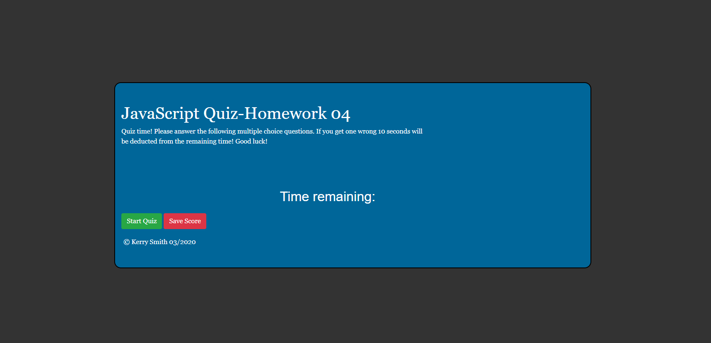

# KERRY SMITH - HOMEWORK 4 - javascript Quiz app

Link url (https://kerry-jr.github.io/homework04/)

                -=-=-=-=- Functioning quiz made with javascript -=-=-=-=-=-

# 04 JavaScript: Online Quiz
...

Homework 04 UCB bootcamp - Create and depoly a quiz that uses javascript to ask questions, record answers, checks to see if user choice is correct answer then scores accordingly.  If user provides wrong answer the user will be deducted 10 seconds from the 90 second quiz. The userName and score are saved to local stoage and display on the quiz page.  Also the quiz will alert the user at the end of the quiz with their results.

## Building the project

Using javascript, html, and css I created a 10 question quiz for students in the web dev space. When user clicks on the start quiz button multiple functions fire setting the userName on screen, begining the quiz with the first question and starting a 90 second timer.  If the user gets the correct answer the app will log the point and present the next question. If the user gets the wrong answer 10 seconds will be deducted from the time.  If the user keeps getting the wrong answer when the timer hits 0 (zero) the quiz will stop.

## Troubleshooting

Mainly figuring out the logic for the user experience.  Start game click button all the way through the questions and then alerting user of the score. Psuedo-coding and refactoring was key to building this app. Receiving important help from the TA's and my tutor were necessary to fully understand the flow of the project. This project had it's difficulties by the way of using the correct logic ("computer speak") and making it make sense in "human speak". Spent hours researching javascript terms and methods to fully understand exaclty how it works and why.

## HOW I BUILT AND TECH USED

1.) Declared multiple variables 
2.) For loops, if statements, and DOM manipulation.
3.) Achieved having a function take input from user and then generate score for users uniquely.
4.) HTML
5.) CSS
6.) JAVASCRIPT
7.) Local storage

Screen of app

By: Kerry Smith 03-29-2020